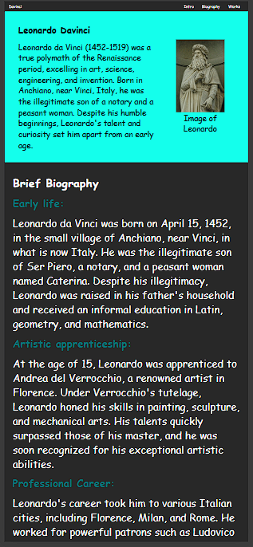
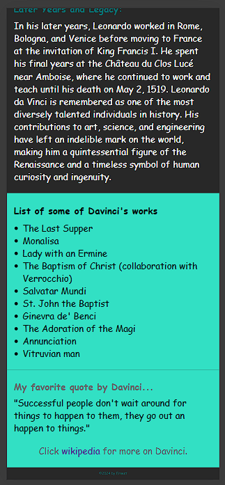
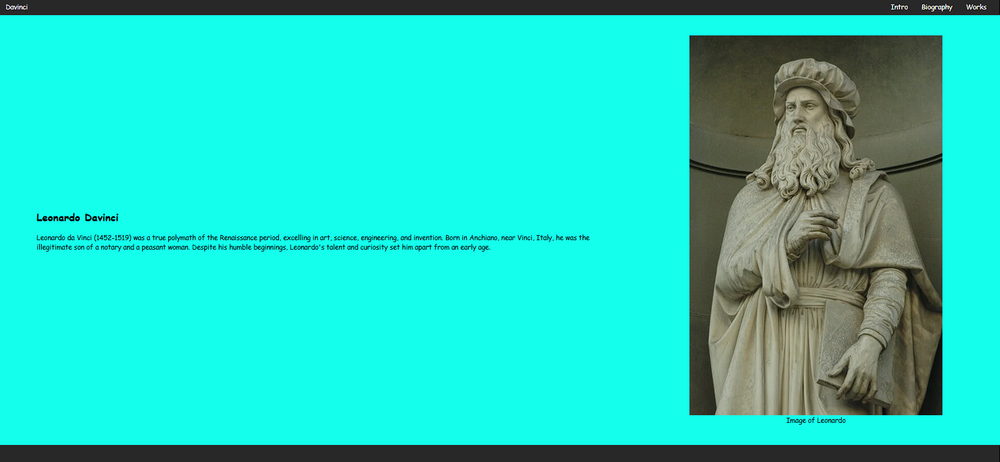

# Tribute-website
A tribute website in honor of Leonardo DaVinci.
This website is built using HTML and CSS. It is also a required project to access a [freecodecamp's](https://www.freecodecamp.org/) Responsive Web Design Certification.

## Demo




## Prerequisites

Before you begin, ensure you have met the following requirements:

* [Git](https://git-scm.com/downloads "Download Git") must be installed on your operating system.

## Installing Tribute-website

To install **Tribute-website**, follow these steps:

Linux and macOS:

```bash
sudo git clone https://github.com/ernestquarshie/Tribute-website.git
```

Windows:

```bash
git clone https://github.com/ernestquarshie/Tribute-website.git
```


## License

This project is **free to use** and does not contain any license.
